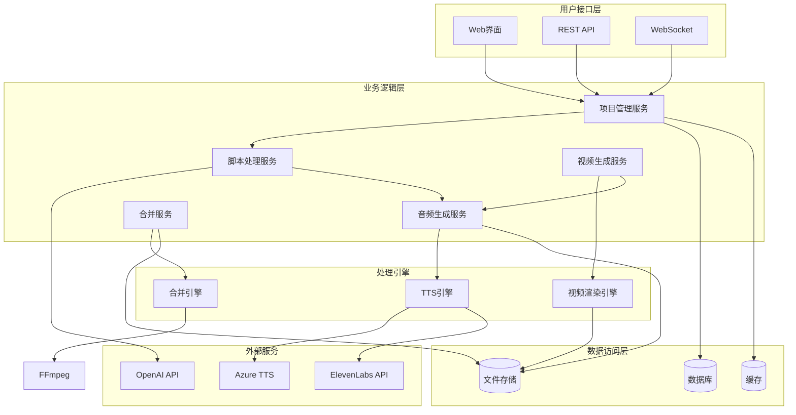
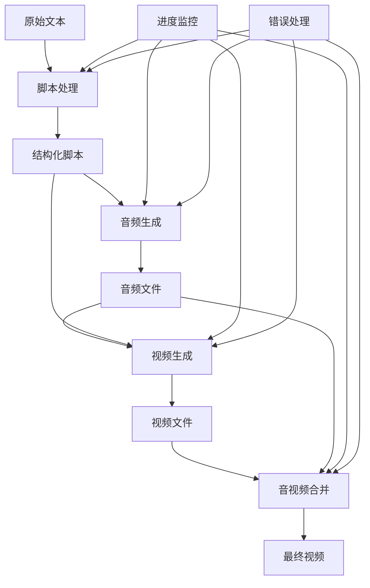
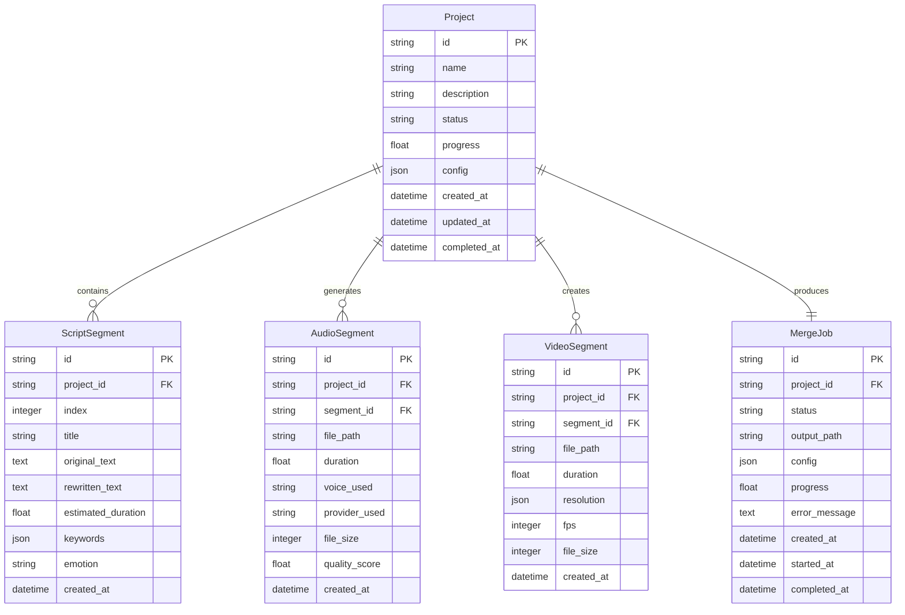

# AI视频生成器 - 核心技术架构文档

## 1. 系统概述

### 1.1 架构目标
- **模块化设计**：各组件独立开发、测试、部署
- **可扩展性**：支持多种TTS提供商和视频效果
- **高性能**：并行处理，异步操作
- **易用性**：Web界面和API双重接口
- **可维护性**：清晰的代码结构和文档

### 1.2 技术栈

```mermaid
graph TB
    subgraph "前端技术栈"
        A[React 18] --> B[TypeScript]
        B --> C[Ant Design]
        C --> D[WebSocket Client]
    end
    
    subgraph "后端技术栈"
        E[FastAPI] --> F[Python 3.9+]
        F --> G[SQLAlchemy]
        G --> H[PostgreSQL/SQLite]
        E --> I[Redis]
        I --> J[WebSocket Server]
    end
    
    subgraph "AI/媒体处理"
        K[OpenAI GPT] --> L[Azure TTS]
        L --> M[ElevenLabs]
        M --> N[MoviePy]
        N --> O[FFmpeg]
        O --> P[OpenCV]
    end
    
    subgraph "部署技术"
        Q[Docker] --> R[Docker Compose]
        R --> S[Nginx]
        S --> T[Uvicorn]
    end
```


## 2. 系统架构

### 2.1 整体架构图


### 2.2 数据流架构


## 3. 核心模块设计

### 3.1 脚本处理模块

#### 架构设计
```python
# 脚本处理模块架构
script_processor/
├── __init__.py
├── core/
│   ├── __init__.py
│   ├── rewriter.py          # 文本改写核心
│   ├── segmenter.py         # 智能分段
│   ├── keyword_extractor.py  # 关键词提取
│   └── validator.py         # 脚本验证
├── ai/
│   ├── __init__.py
│   ├── openai_client.py     # OpenAI集成
│   ├── prompt_manager.py    # 提示词管理
│   └── response_parser.py   # 响应解析
├── models/
│   ├── __init__.py
│   ├── script.py            # 脚本数据模型
│   ├── segment.py          # 段落数据模型
│   └── keyword.py          # 关键词模型
├── utils/
│   ├── __init__.py
│   ├── text_utils.py       # 文本工具
│   ├── language_detector.py # 语言检测
│   └── cache.py           # 缓存管理
└── config/
    ├── __init__.py
    └── settings.py         # 配置管理
```

#### 核心接口
```python
from abc import ABC, abstractmethod

class ScriptProcessorInterface(ABC):
    """脚本处理器接口"""
    
    @abstractmethod
    async def process_script(self, text: str, config: ProcessConfig) -> ProcessedScript:
        """处理脚本"""
        pass
    
    @abstractmethod
    async def validate_script(self, text: str) -> ValidationResult:
        """验证脚本"""
        pass

class TextRewriterInterface(ABC):
    """文本改写接口"""
    
    @abstractmethod
    async def rewrite(self, text: str, style: str) -> str:
        """改写文本"""
        pass

class SegmenterInterface(ABC):
    """分段器接口"""
    
    @abstractmethod
    async def segment(self, text: str, target_duration: float) -> List[Segment]:
        """分段"""
        pass
```

### 3.2 音频生成模块

#### 架构设计
```python
# 音频生成模块架构
audio_generator/
├── __init__.py
├── core/
│   ├── __init__.py
│   ├── tts_manager.py       # TTS管理器
│   ├── segment_processor.py # 段落处理器
│   ├── duration_analyzer.py # 时长分析器
│   └── quality_checker.py  # 质量检查器
├── providers/
│   ├── __init__.py
│   ├── base_provider.py    # 基础提供商
│   ├── azure_provider.py   # Azure TTS
│   ├── elevenlabs_provider.py # ElevenLabs
│   ├── google_provider.py  # Google TTS
│   └── local_provider.py   # 本地TTS
├── models/
│   ├── __init__.py
│   ├── audio_request.py    # 音频请求模型
│   ├── audio_response.py   # 音频响应模型
│   ├── voice_config.py     # 语音配置
│   └── quality_report.py   # 质量报告
├── utils/
│   ├── __init__.py
│   ├── audio_utils.py      # 音频工具
│   ├── file_manager.py     # 文件管理
│   └── retry_handler.py    # 重试处理
└── integration/
    ├── __init__.py
    └── ai_audio_client.py  # ai.audio集成
```

#### TTS抽象层
```python
class TTSProviderInterface(ABC):
    """TTS提供商接口"""
    
    @abstractmethod
    async def get_available_voices(self) -> List[VoiceInfo]:
        """获取可用语音"""
        pass
    
    @abstractmethod
    async def synthesize(self, request: TTSRequest) -> TTSResponse:
        """合成语音"""
        pass
    
    @abstractmethod
    async def get_voice_preview(self, voice_id: str, text: str) -> bytes:
        """获取语音预览"""
        pass
    
    @abstractmethod
    def get_supported_formats(self) -> List[str]:
        """获取支持的格式"""
        pass

class TTSManager:
    """TTS管理器"""
    
    def __init__(self):
        self.providers: Dict[str, TTSProviderInterface] = {}
        self.fallback_chain: List[str] = []
    
    async def synthesize_with_fallback(self, request: TTSRequest) -> TTSResponse:
        """带回退的语音合成"""
        for provider_name in self.fallback_chain:
            try:
                provider = self.providers[provider_name]
                return await provider.synthesize(request)
            except Exception as e:
                logger.warning(f"Provider {provider_name} failed: {e}")
                continue
        
        raise TTSAllProvidersFailedError("All TTS providers failed")
```

### 3.3 视频生成模块

#### 架构设计
```python
# 视频生成模块架构
video_generator/
├── __init__.py
├── core/
│   ├── __init__.py
│   ├── video_generator.py   # 视频生成器
│   ├── text_renderer.py     # 文字渲染
│   ├── background_animator.py # 背景动画
│   ├── subtitle_engine.py   # 字幕引擎
│   └── font_manager.py     # 字体管理
├── effects/
│   ├── __init__.py
│   ├── transitions.py       # 转场效果
│   ├── animations.py       # 动画效果
│   ├── filters.py          # 滤镜效果
│   └── presets.py          # 效果预设
├── renderers/
│   ├── __init__.py
│   ├── text_renderer.py     # 文字渲染器
│   ├── keyword_highlighter.py # 关键词高亮
│   └── background_renderer.py # 背景渲染
├── models/
│   ├── __init__.py
│   ├── video_config.py      # 视频配置
│   ├── text_content.py      # 文本内容
│   ├── video_segment.py     # 视频段落
│   └── animation_config.py # 动画配置
└── utils/
    ├── __init__.py
    ├── video_utils.py      # 视频工具
    ├── color_utils.py      # 颜色工具
    └── geometry_utils.py   # 几何工具
```

#### 渲染管道
```python
class VideoRenderingPipeline:
    """视频渲染管道"""
    
    def __init__(self, config: VideoConfig):
        self.config = config
        self.text_renderer = TextRenderer(config)
        self.background_animator = BackgroundAnimator(config)
        self.effect_processor = EffectProcessor(config)
    
    async def render_segment(self, segment: VideoSegmentRequest) -> VideoSegment:
        """渲染单个段落"""
        # 1. 准备渲染上下文
        context = RenderingContext(segment, self.config)
        
        # 2. 渲染背景
        background_clip = await self.background_animator.create_background(
            context.duration, context.emotion
        )
        
        # 3. 渲染文字层
        text_clips = await self.text_renderer.render_text_layers(context)
        
        # 4. 应用效果
        effect_clips = await self.effect_processor.apply_effects(context)
        
        # 5. 合成最终视频
        final_clip = self._compose_clips([
            background_clip,
            *text_clips,
            *effect_clips
        ])
        
        # 6. 导出视频
        output_path = await self._export_clip(final_clip, context)
        
        return VideoSegment(
            segment_id=segment.segment_id,
            file_path=output_path,
            duration=segment.duration,
            resolution=self.config.resolution,
            fps=self.config.fps
        )
```

### 3.4 合并模块

#### 架构设计
```python
# 合并模块架构
aggregator/
├── __init__.py
├── core/
│   ├── __init__.py
│   ├── merge_pipeline.py   # 合并管道
│   ├── synchronizer.py      # 同步器
│   ├── transition_processor.py # 转场处理器
│   └── quality_controller.py # 质量控制器
├── ffmpeg/
│   ├── __init__.py
│   ├── processor.py        # FFmpeg处理器
│   ├── command_builder.py  # 命令构建器
│   ├── filter_generator.py # 滤镜生成器
│   └── validator.py        # 验证器
├── models/
│   ├── __init__.py
│   ├── merge_config.py     # 合并配置
│   ├── sync_point.py       # 同步点
│   ├── transition_config.py # 转场配置
│   └── quality_report.py   # 质量报告
└── batch/
    ├── __init__.py
    ├── processor.py        # 批处理器
    ├── queue_manager.py    # 队列管理
    └── job_scheduler.py    # 任务调度
```

#### 同步算法
```python
class AudioVideoSynchronizer:
    """音视频同步器"""
    
    def __init__(self, config: SyncConfig):
        self.config = config
        self.tolerance_ms = config.tolerance_ms
    
    async def synchronize(self, video_segments: List[VideoSegment], 
                       audio_segments: List[AudioSegment]) -> SyncResult:
        """同步音视频"""
        # 1. 创建时间轴
        video_timeline = self._create_timeline(video_segments)
        audio_timeline = self._create_timeline(audio_segments)
        
        # 2. 检测同步点
        sync_points = await self._detect_sync_points(video_timeline, audio_timeline)
        
        # 3. 计算偏移量
        offsets = self._calculate_offsets(sync_points)
        
        # 4. 应用同步调整
        adjusted_segments = await self._apply_adjustments(
            video_segments, audio_segments, offsets
        )
        
        # 5. 生成同步报告
        report = self._generate_sync_report(sync_points, offsets)
        
        return SyncResult(
            video_segments=adjusted_segments["video"],
            audio_segments=adjusted_segments["audio"],
            sync_points=sync_points,
            offsets=offsets,
            report=report
        )
```

## 4. 数据架构

### 4.1 数据模型关系


### 4.2 配置数据结构
```json
{
  "project_config": {
    "script_processing": {
      "style": "conversational",
      "segment_duration": 45,
      "max_duration": 60,
      "language": "zh"
    },
    "audio_generation": {
      "provider": "azure",
      "voice": "zh-CN-XiaoxiaoNeural",
      "speed": 1.0,
      "pitch": 0.0,
      "format": "mp3"
    },
    "video_generation": {
      "resolution": "1920x1080",
      "fps": 30,
      "font_size_large": 72,
      "font_size_keyword": 48,
      "text_color": "#FFFFFF",
      "keyword_color": "#FFD700",
      "background_type": "gradient"
    },
    "merge": {
      "video_codec": "libx264",
      "audio_codec": "aac",
      "preset": "medium",
      "crf": 23,
      "enable_transitions": true,
      "transition_type": "fade"
    }
  }
}
```

## 5. 接口设计

### 5.1 核心接口定义
```python
# 核心接口
class VideoGeneratorInterface(ABC):
    """视频生成器核心接口"""
    
    @abstractmethod
    async def generate_video_from_text(self, text: str, config: ProjectConfig) -> str:
        """从文本生成视频"""
        pass
    
    @abstractmethod
    async def get_generation_status(self, project_id: str) -> GenerationStatus:
        """获取生成状态"""
        pass
    
    @abstractmethod
    async def cancel_generation(self, project_id: str) -> bool:
        """取消生成"""
        pass

class ProjectManagerInterface(ABC):
    """项目管理接口"""
    
    @abstractmethod
    async def create_project(self, request: CreateProjectRequest) -> Project:
        """创建项目"""
        pass
    
    @abstractmethod
    async def get_project(self, project_id: str) -> Optional[Project]:
        """获取项目"""
        pass
    
    @abstractmethod
    async def list_projects(self, filters: ProjectFilters) -> List[Project]:
        """列出项目"""
        pass
```

### 5.2 API接口规范
```yaml
# OpenAPI规范概要
openapi: 3.0.0
info:
  title: AI视频生成器API
  version: 1.0.0
  description: 基于AI的自动化视频生成系统

paths:
  /api/projects:
    post:
      summary: 创建新项目
      requestBody:
        required: true
        content:
          application/json:
            schema:
              $ref: '#/components/schemas/CreateProjectRequest'
      responses:
        '201':
          description: 项目创建成功
          content:
            application/json:
              schema:
                $ref: '#/components/schemas/Project'
    
    get:
      summary: 获取项目列表
      parameters:
        - name: skip
          in: query
          schema:
            type: integer
            default: 0
        - name: limit
          in: query
          schema:
            type: integer
            default: 50
        - name: status
          in: query
          schema:
            type: string
            enum: [pending, processing, completed, failed]
      responses:
        '200':
          description: 项目列表
          content:
            application/json:
              schema:
                type: array
                items:
                  $ref: '#/components/schemas/Project'

  /api/projects/{project_id}:
    get:
      summary: 获取项目详情
      parameters:
        - name: project_id
          in: path
          required: true
          schema:
            type: string
      responses:
        '200':
          description: 项目详情
          content:
            application/json:
              schema:
                $ref: '#/components/schemas/Project'
        '404':
          description: 项目不存在

components:
  schemas:
    Project:
      type: object
      properties:
        id:
          type: string
        name:
          type: string
        description:
          type: string
        status:
          type: string
          enum: [pending, processing, completed, failed]
        progress:
          type: number
          minimum: 0
          maximum: 1
        created_at:
          type: string
          format: date-time
        updated_at:
          type: string
          format: date-time
        config:
          type: object
```

## 6. 性能优化策略

### 6.1 并发处理
```python
# 并发处理架构
class ConcurrentProcessor:
    """并发处理器"""
    
    def __init__(self, max_workers: int = 4):
        self.max_workers = max_workers
        self.executor = ThreadPoolExecutor(max_workers=max_workers)
        self.semaphore = asyncio.Semaphore(max_workers)
    
    async def process_segments_concurrently(self, 
                                        segments: List[Any],
                                        processor_func: Callable) -> List[Any]:
        """并发处理段落"""
        tasks = []
        
        for segment in segments:
            task = self._process_with_semaphore(segment, processor_func)
            tasks.append(task)
        
        results = await asyncio.gather(*tasks, return_exceptions=True)
        
        return [
            result for result in results 
            if not isinstance(result, Exception)
        ]
    
    async def _process_with_semaphore(self, segment: Any, 
                                    processor_func: Callable) -> Any:
        """带信号量的处理"""
        async with self.semaphore:
            loop = asyncio.get_event_loop()
            return await loop.run_in_executor(
                self.executor, processor_func, segment
            )
```

### 6.2 缓存策略
```python
# 多级缓存系统
class CacheManager:
    """缓存管理器"""
    
    def __init__(self):
        self.memory_cache = {}
        self.redis_client = redis.Redis()
        self.file_cache = FileCache("./cache")
    
    async def get(self, key: str, cache_type: str = "auto") -> Any:
        """获取缓存"""
        if cache_type == "memory":
            return self.memory_cache.get(key)
        elif cache_type == "redis":
            return await self.redis_client.get(key)
        elif cache_type == "file":
            return await self.file_cache.get(key)
        else:  # auto
            # 按优先级尝试：memory -> redis -> file
            if key in self.memory_cache:
                return self.memory_cache[key]
            
            redis_value = await self.redis_client.get(key)
            if redis_value:
                self.memory_cache[key] = redis_value
                return redis_value
            
            file_value = await self.file_cache.get(key)
            if file_value:
                self.memory_cache[key] = file_value
                await self.redis_client.set(key, file_value)
                return file_value
            
            return None
    
    async def set(self, key: str, value: Any, ttl: int = 3600, 
                   cache_type: str = "auto"):
        """设置缓存"""
        if cache_type == "memory":
            self.memory_cache[key] = value
        elif cache_type == "redis":
            await self.redis_client.setex(key, ttl, value)
        elif cache_type == "file":
            await self.file_cache.set(key, value, ttl)
        else:  # auto
            self.memory_cache[key] = value
            await self.redis_client.setex(key, ttl, value)
            await self.file_cache.set(key, value, ttl)
```

### 6.3 资源管理
```python
# 资源管理器
class ResourceManager:
    """资源管理器"""
    
    def __init__(self):
        self.cpu_usage = psutil.cpu_percent()
        self.memory_usage = psutil.virtual_memory().percent
        self.disk_usage = psutil.disk_usage('/').percent
        
    def can_accept_new_job(self) -> bool:
        """检查是否可以接受新任务"""
        return (
            self.cpu_usage < 80 and
            self.memory_usage < 80 and
            self.disk_usage > 10  # 至少10%可用空间
        )
    
    def get_optimal_concurrency(self) -> int:
        """获取最优并发数"""
        cpu_cores = psutil.cpu_count()
        memory_gb = psutil.virtual_memory().total / (1024**3)
        
        # 基于CPU核心数和内存计算最优并发数
        cpu_based = max(1, cpu_cores - 1)
        memory_based = max(1, int(memory_gb / 2))  # 每2GB内存一个并发
        
        return min(cpu_based, memory_based, 8)  # 最多8个并发
```

## 7. 错误处理和容错

### 7.1 异常层次结构
```python
# 异常体系
class VideoGeneratorError(Exception):
    """视频生成器基础异常"""
    pass

class ScriptProcessingError(VideoGeneratorError):
    """脚本处理异常"""
    pass

class AudioGenerationError(VideoGeneratorError):
    """音频生成异常"""
    pass

class VideoGenerationError(VideoGeneratorError):
    """视频生成异常"""
    pass

class MergeError(VideoGeneratorError):
    """合并异常"""
    pass

class TTSProviderError(AudioGenerationError):
    """TTS提供商异常"""
    pass

class FFmpegError(MergeError):
    """FFmpeg异常"""
    pass
```

### 7.2 重试和回退机制
```python
# 重试装饰器
def resilient_retry(max_attempts: int = 3, 
                  backoff_factor: float = 2.0,
                  exceptions: tuple = (Exception,)):
    """弹性重试装饰器"""
    def decorator(func):
        @functools.wraps(func)
        async def wrapper(*args, **kwargs):
            last_exception = None
            
            for attempt in range(max_attempts):
                try:
                    return await func(*args, **kwargs)
                except exceptions as e:
                    last_exception = e
                    
                    if attempt == max_attempts - 1:
                        break
                    
                    delay = backoff_factor ** attempt
                    logger.warning(
                        f"Attempt {attempt + 1} failed, retrying in {delay}s: {e}"
                    )
                    await asyncio.sleep(delay)
            
            raise last_exception
        
        return wrapper
    return decorator

# 断路器模式
class CircuitBreaker:
    """断路器"""
    
    def __init__(self, failure_threshold: int = 5, 
                 recovery_timeout: float = 60.0):
        self.failure_threshold = failure_threshold
        self.recovery_timeout = recovery_timeout
        self.failure_count = 0
        self.last_failure_time = None
        self.state = "CLOSED"  # CLOSED, OPEN, HALF_OPEN
    
    async def call(self, func, *args, **kwargs):
        """调用函数"""
        if self.state == "OPEN":
            if self._should_attempt_reset():
                self.state = "HALF_OPEN"
            else:
                raise CircuitBreakerOpenError("Circuit breaker is OPEN")
        
        try:
            result = await func(*args, **kwargs)
            self._on_success()
            return result
        except Exception as e:
            self._on_failure()
            raise
    
    def _should_attempt_reset(self) -> bool:
        """是否应该尝试重置"""
        return (
            self.last_failure_time and
            time.time() - self.last_failure_time >= self.recovery_timeout
        )
    
    def _on_success(self):
        """成功处理"""
        self.failure_count = 0
        self.state = "CLOSED"
    
    def _on_failure(self):
        """失败处理"""
        self.failure_count += 1
        self.last_failure_time = time.time()
        
        if self.failure_count >= self.failure_threshold:
            self.state = "OPEN"
```

## 8. 监控和日志

### 8.1 监控指标
```python
# 监控指标收集
class MetricsCollector:
    """指标收集器"""
    
    def __init__(self):
        self.counters = {}
        self.histograms = {}
        self.gauges = {}
    
    def increment_counter(self, name: str, tags: dict = None, value: int = 1):
        """增加计数器"""
        key = self._make_key(name, tags)
        self.counters[key] = self.counters.get(key, 0) + value
    
    def record_histogram(self, name: str, value: float, tags: dict = None):
        """记录直方图"""
        key = self._make_key(name, tags)
        if key not in self.histograms:
            self.histograms[key] = []
        self.histograms[key].append(value)
    
    def set_gauge(self, name: str, value: float, tags: dict = None):
        """设置仪表盘"""
        key = self._make_key(name, tags)
        self.gauges[key] = value
    
    def get_metrics_summary(self) -> dict:
        """获取指标摘要"""
        return {
            "counters": self.counters,
            "histograms": {
                key: {
                    "count": len(values),
                    "sum": sum(values),
                    "avg": sum(values) / len(values) if values else 0,
                    "min": min(values) if values else 0,
                    "max": max(values) if values else 0
                }
                for key, values in self.histograms.items()
            },
            "gauges": self.gauges
        }
```

### 8.2 结构化日志
```python
# 结构化日志
class StructuredLogger:
    """结构化日志器"""
    
    def __init__(self, name: str):
        self.logger = logging.getLogger(name)
        self.context = {}
    
    def set_context(self, **kwargs):
        """设置上下文"""
        self.context.update(kwargs)
    
    def clear_context(self):
        """清除上下文"""
        self.context.clear()
    
    def _log(self, level: str, message: str, **kwargs):
        """记录日志"""
        log_data = {
            "timestamp": datetime.now().isoformat(),
            "level": level,
            "message": message,
            "context": self.context.copy(),
            **kwargs
        }
        
        getattr(self.logger, level)(json.dumps(log_data, ensure_ascii=False))
    
    def info(self, message: str, **kwargs):
        """信息日志"""
        self._log("info", message, **kwargs)
    
    def warning(self, message: str, **kwargs):
        """警告日志"""
        self._log("warning", message, **kwargs)
    
    def error(self, message: str, **kwargs):
        """错误日志"""
        self._log("error", message, **kwargs)
    
    def debug(self, message: str, **kwargs):
        """调试日志"""
        self._log("debug", message, **kwargs)
```

## 9. 安全设计

### 9.1 API安全
```python
# API安全中间件
class SecurityMiddleware:
    """安全中间件"""
    
    def __init__(self, app):
        self.app = app
    
    async def __call__(self, scope, receive, send):
        # 请求大小限制
        if scope["type"] == "http":
            content_length = scope.get("headers", {}).get(b"content-length")
            if content_length and int(content_length) > 100 * 1024 * 1024:  # 100MB
                await self._send_error(send, 413, "Request entity too large")
                return
        
        # 速率限制
        client_ip = self._get_client_ip(scope)
        if not await self._check_rate_limit(client_ip):
            await self._send_error(send, 429, "Too many requests")
            return
        
        # 调用下一个中间件
        await self.app(scope, receive, send)
    
    async def _check_rate_limit(self, client_ip: str) -> bool:
        """检查速率限制"""
        # 实现速率限制逻辑
        pass
    
    def _get_client_ip(self, scope) -> str:
        """获取客户端IP"""
        # 实现IP获取逻辑
        pass
```

### 9.2 数据验证
```python
# 数据验证
from pydantic import BaseModel, validator
from typing import Optional

class ProjectCreateRequest(BaseModel):
    name: str
    description: Optional[str] = None
    script_content: str
    config: Optional[dict] = None
    
    @validator('name')
    def validate_name(cls, v):
        if not v or len(v.strip()) == 0:
            raise ValueError('项目名称不能为空')
        if len(v) > 255:
            raise ValueError('项目名称不能超过255个字符')
        return v.strip()
    
    @validator('script_content')
    def validate_script_content(cls, v):
        if not v or len(v.strip()) == 0:
            raise ValueError('脚本内容不能为空')
        if len(v) > 100000:  # 100KB
            raise ValueError('脚本内容不能超过100KB')
        return v.strip()
    
    @validator('config')
    def validate_config(cls, v):
        if v is not None:
            # 验证配置的格式和内容
            if not isinstance(v, dict):
                raise ValueError('配置必须是字典格式')
        return v
```

## 10. 部署架构

### 10.1 容器化部署
```yaml
# 生产环境部署配置
version: '3.8'

services:
  nginx:
    image: nginx:alpine
    ports:
      - "80:80"
      - "443:443"
    volumes:
      - ./nginx.conf:/etc/nginx/nginx.conf
      - ./ssl:/etc/nginx/ssl
    depends_on:
      - backend
      - frontend
  
  frontend:
    build:
      context: ./web_interface/frontend
      dockerfile: Dockerfile.prod
    environment:
      - REACT_APP_API_URL=https://api.yourdomain.com
    restart: unless-stopped
  
  backend:
    build:
      context: ./web_interface/backend
      dockerfile: Dockerfile.prod
    environment:
      - DATABASE_URL=postgresql://user:password@db:5432/video_generator
      - REDIS_URL=redis://redis:6379/0
      - SECRET_KEY=${SECRET_KEY}
      - OPENAI_API_KEY=${OPENAI_API_KEY}
      - AZURE_SPEECH_KEY=${AZURE_SPEECH_KEY}
      - ELEVENLABS_API_KEY=${ELEVENLABS_API_KEY}
    volumes:
      - ./outputs:/app/outputs
      - ./temp:/app/temp
      - ./logs:/app/logs
    depends_on:
      - db
      - redis
    restart: unless-stopped
    deploy:
      replicas: 2
      resources:
        limits:
          cpus: '1.0'
          memory: 2G
        reservations:
          cpus: '0.5'
          memory: 1G
  
  worker:
    build:
      context: ./web_interface/backend
      dockerfile: Dockerfile.prod
    command: python -m celery worker -A tasks.celery_app --loglevel=info
    environment:
      - DATABASE_URL=postgresql://user:password@db:5432/video_generator
      - REDIS_URL=redis://redis:6379/0
      - OPENAI_API_KEY=${OPENAI_API_KEY}
      - AZURE_SPEECH_KEY=${AZURE_SPEECH_KEY}
      - ELEVENLABS_API_KEY=${ELEVENLABS_API_KEY}
    volumes:
      - ./outputs:/app/outputs
      - ./temp:/app/temp
      - ./logs:/app/logs
    depends_on:
      - db
      - redis
    restart: unless-stopped
    deploy:
      replicas: 4
      resources:
        limits:
          cpus: '2.0'
          memory: 4G
        reservations:
          cpus: '1.0'
          memory: 2G
  
  db:
    image: postgres:13
    environment:
      - POSTGRES_DB=video_generator
      - POSTGRES_USER=${DB_USER}
      - POSTGRES_PASSWORD=${DB_PASSWORD}
    volumes:
      - postgres_data:/var/lib/postgresql/data
      - ./backups:/backups
    restart: unless-stopped
    deploy:
      resources:
        limits:
          cpus: '1.0'
          memory: 2G
        reservations:
          cpus: '0.5'
          memory: 1G
  
  redis:
    image: redis:6-alpine
    command: redis-server --appendonly yes --maxmemory 1gb --maxmemory-policy allkeys-lru
    volumes:
      - redis_data:/data
    restart: unless-stopped

volumes:
  postgres_data:
  redis_data:
```

### 10.2 监控和日志收集
```yaml
# 监控配置
services:
  prometheus:
    image: prom/prometheus
    ports:
      - "9090:9090"
    volumes:
      - ./monitoring/prometheus.yml:/etc/prometheus/prometheus.yml
      - prometheus_data:/prometheus
    command:
      - '--config.file=/etc/prometheus/prometheus.yml'
      - '--storage.tsdb.path=/prometheus'
      - '--web.console.libraries=/etc/prometheus/console_libraries'
      - '--web.console.templates=/etc/prometheus/consoles'
  
  grafana:
    image: grafana/grafana
    ports:
      - "3001:3000"
    environment:
      - GF_SECURITY_ADMIN_PASSWORD=${GRAFANA_PASSWORD}
    volumes:
      - grafana_data:/var/lib/grafana
      - ./monitoring/grafana/dashboards:/etc/grafana/provisioning/dashboards
      - ./monitoring/grafana/datasources:/etc/grafana/provisioning/datasources
  
  elasticsearch:
    image: docker.elastic.co/elasticsearch/elasticsearch:7.15.0
    environment:
      - discovery.type=single-node
      - "ES_JAVA_OPTS=-Xms1g -Xmx1g"
    volumes:
      - elasticsearch_data:/usr/share/elasticsearch/data
    ports:
      - "9200:9200"
  
  kibana:
    image: docker.elastic.co/kibana/kibana:7.15.0
    environment:
      - ELASTICSEARCH_HOSTS=http://elasticsearch:9200
    ports:
      - "5601:5601"
    depends_on:
      - elasticsearch

volumes:
  prometheus_data:
  grafana_data:
  elasticsearch_data:
```

这个核心技术架构文档为AI视频生成器提供了完整的技术框架，确保系统的可扩展性、可维护性和高性能。
