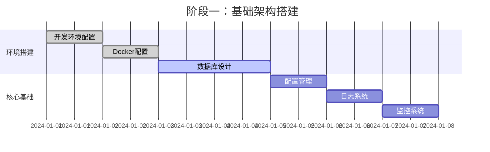
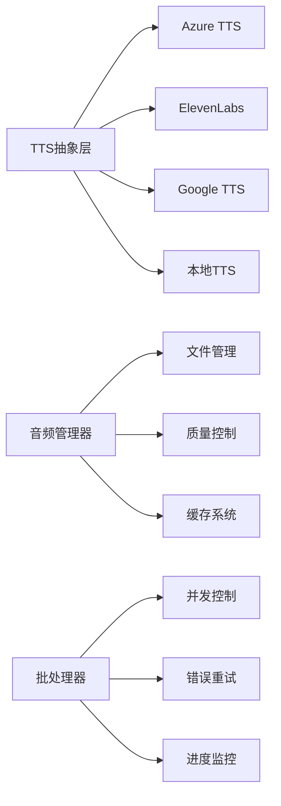
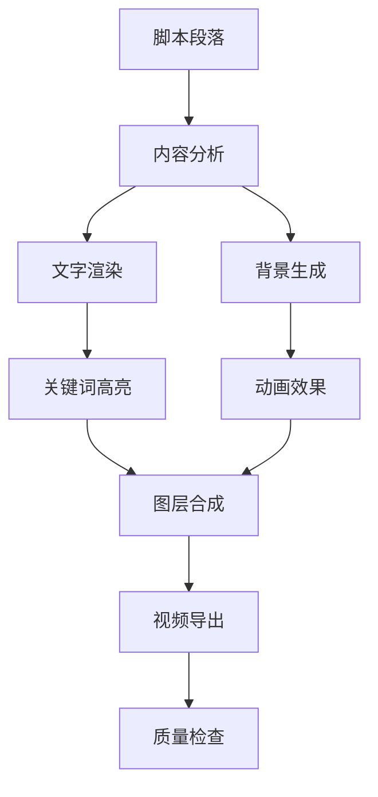
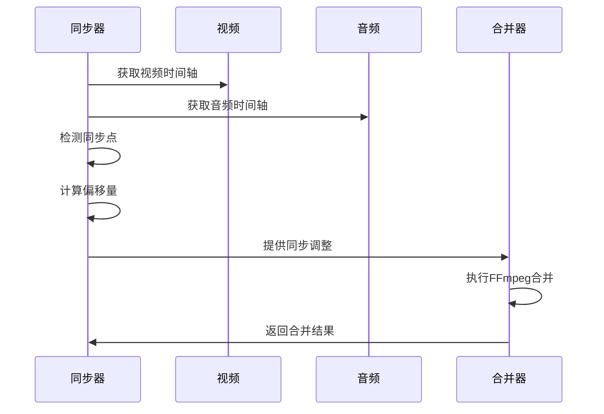
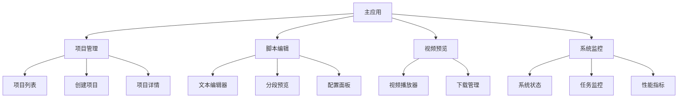
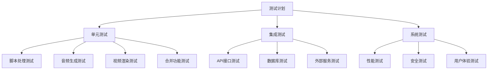
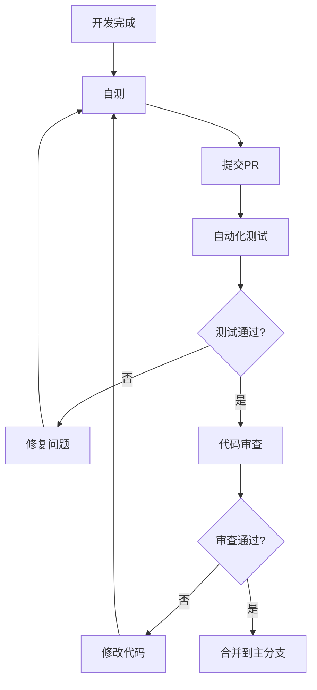
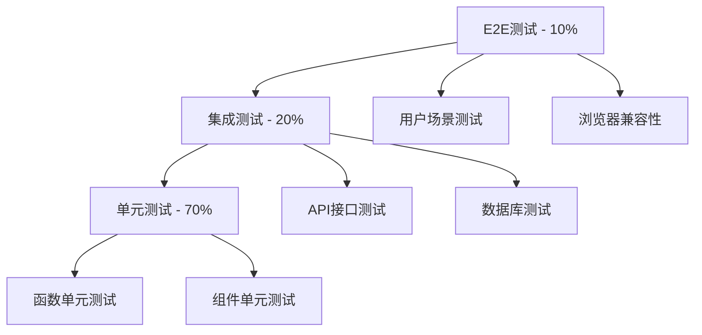
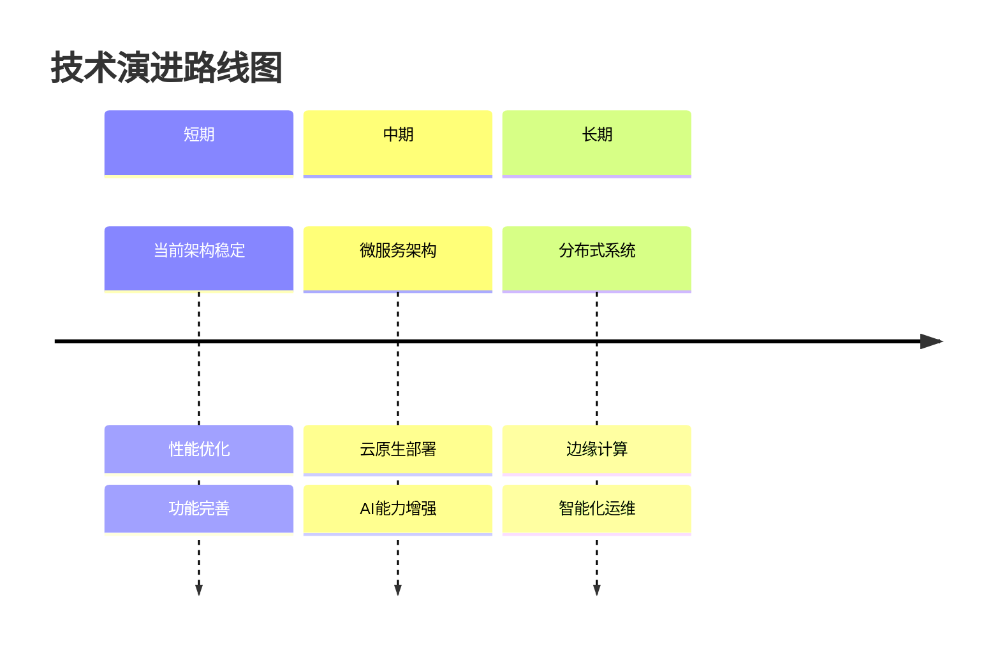

# AI视频生成器 - 项目整体实现计划

## 1. 项目概述

### 1.1 项目目标
构建一个完整的AI视频生成系统，能够：
- 将文本内容转换为专业级视频
- 支持多种TTS提供商和视频效果
- 提供Web界面和API接口
- 实现自动化处理流程
- 支持批量处理和项目管理

### 1.2 核心功能
1. **脚本处理**：AI改写、智能分段、关键词提取
2. **音频生成**：多TTS支持、质量控制、时长精确
3. **视频生成**：文字渲染、背景动画、关键词高亮
4. **音视频合并**：精确同步、转场效果、质量控制
5. **Web界面**：项目管理、实时监控、用户友好
6. **API接口**：RESTful API、WebSocket实时通信

### 1.3 技术特色
- **模块化架构**：各组件独立开发和部署
- **高性能处理**：并发处理、异步操作
- **智能化处理**：AI驱动的内容生成
- **可扩展设计**：支持多种提供商和效果
- **企业级质量**：监控、日志、容错

## 2. 实施阶段规划

### 阶段一：基础架构搭建（第1-2周）

#### 目标
建立项目基础架构和开发环境

#### 主要任务
- [x] 项目结构设计
- [ ] 开发环境搭建
- [ ] 数据库设计和初始化
- [ ] 基础配置管理
- [ ] 日志和监控系统
- [ ] Docker环境配置

#### 详细计划


#### 关键里程碑
- ✅ 完成项目架构设计文档
- 🔄 开发环境可用
- 🔄 数据库模型设计完成
- 🔄 基础监控就位

### 阶段二：脚本处理系统（第3-4周）

#### 目标
实现完整的脚本处理功能

#### 主要任务
- [ ] AI文本改写功能
- [ ] 智能分段算法
- [ ] 关键词提取系统
- [ ] 语言检测和优化
- [ ] 脚本验证和质量检查
- [ ] 缓存和性能优化

#### 实现优先级
1. **高优先级**
   - OpenAI集成和文本改写
   - 基础分段算法
   - 数据模型和API

2. **中优先级**
   - 关键词提取
   - 高级分段算法
   - 质量验证

3. **低优先级**
   - 性能优化
   - 缓存机制
   - 错误处理增强

#### 技术要求
```python
# 脚本处理系统核心指标
script_processing_requirements = {
    "processing_speed": ">= 1000字/秒",
    "segment_accuracy": ">= 95%",
    "keyword_precision": ">= 90%",
    "api_response_time": "<= 2秒",
    "error_rate": "<= 1%"
}
```

### 阶段三：音频生成系统（第5-6周）

#### 目标
集成多种TTS服务，实现高质量音频生成

#### 主要任务
- [ ] TTS提供商抽象层
- [ ] Azure TTS集成
- [ ] ElevenLabs集成
- [ ] 本地TTS支持
- [ ] 音频质量检查
- [ ] 批量处理和并发控制
- [ ] 时长精确控制

#### TTS集成计划


#### 质量标准
```python
audio_quality_standards = {
    "sample_rate": "22050Hz 或更高",
    "bit_rate": ">= 128kbps",
    "snr_ratio": ">= 20dB",
    "format_support": ["MP3", "WAV"],
    "max_duration_error": "0.1秒"
}
```

### 阶段四：视频生成系统（第7-8周）

#### 目标
实现文字视频生成，支持动态效果和自定义样式

#### 主要任务
- [ ] 视频渲染引擎
- [ ] 文字渲染和字体管理
- [ ] 背景动画系统
- [ ] 关键词高亮效果
- [ ] 转场和动画效果
- [ ] 字幕生成
- [ ] 视频质量控制

#### 渲染管道设计


#### 效果库规划
```python
video_effects_library = {
    "transitions": [
        "fade", "crossfade", "dissolve", 
        "slide", "zoom", "wipe"
    ],
    "animations": [
        "typewriter", "fade_in", "slide_in",
        "bounce", "pulse", "glow"
    ],
    "backgrounds": [
        "gradient", "particles", "waves",
        "geometric", "abstract", "solid"
    ]
}
```

### 阶段五：合并系统（第9-10周）

#### 目标
实现音视频同步合并，支持多种转场效果

#### 主要任务
- [ ] FFmpeg集成和命令构建
- [ ] 音视频同步算法
- [ ] 转场效果处理
- [ ] 批量合并管道
- [ ] 质量控制和验证
- [ ] 输出格式支持

#### 同步算法流程


#### 质量保证
```python
merge_quality_requirements = {
    "sync_tolerance": "<= 100ms",
    "video_quality": "CRF <= 23",
    "audio_quality": ">= 192kbps",
    "transition_smoothness": "无掉帧",
    "output_format": "MP4 (H.264/AAC)"
}
```

### 阶段六：Web界面开发（第11-12周）

#### 目标
构建完整的Web界面，提供用户友好的操作体验

#### 主要任务
- [ ] React应用架构
- [ ] 项目管理界面
- [ ] 脚本编辑器
- [ ] 配置管理面板
- [ ] 实时进度显示
- [ ] 结果预览和下载
- [ ] 系统监控仪表板

#### 界面模块


#### 用户体验要求
```python
ux_requirements = {
    "page_load_time": "<= 2秒",
    "interaction_response": "<= 200ms",
    "progress_update": "实时",
    "error_handling": "友好提示",
    "mobile_support": "响应式设计",
    "accessibility": "WCAG 2.1 AA"
}
```

### 阶段七：API和集成（第13-14周）

#### 目标
完善API接口，实现系统集成和测试

#### 主要任务
- [ ] RESTful API完善
- [ ] WebSocket实时通信
- [ ] API文档生成
- [ ] 第三方集成测试
- [ ] 性能优化
- [ ] 安全加固
- [ ] 错误处理完善

#### API设计
```yaml
# API端点规划
api_endpoints:
  projects:
    - GET /api/projects
    - POST /api/projects
    - GET /api/projects/{id}
    - PUT /api/projects/{id}
    - DELETE /api/projects/{id}
    - GET /api/projects/{id}/progress
  
  scripts:
    - POST /api/scripts/upload
    - POST /api/scripts/process
    - GET /api/scripts/presets
  
  audio:
    - GET /api/audio/providers
    - GET /api/audio/voices/{provider}
    - POST /api/audio/generate
    - GET /api/audio/{id}/preview
  
  video:
    - POST /api/video/generate
    - GET /api/video/effects
    - POST /api/video/render
  
  merge:
    - POST /api/merge/process
    - GET /api/merge/status/{id}
    - POST /api/merge/batch
```

### 阶段八：测试和优化（第15-16周）

#### 目标
全面测试系统性能，优化用户体验

#### 主要任务
- [ ] 单元测试覆盖
- [ ] 集成测试
- [ ] 性能压力测试
- [ ] 用户验收测试
- [ ] 安全测试
- [ ] 兼容性测试
- [ ] 文档完善

#### 测试策略


#### 性能目标
```python
performance_targets = {
    "end_to_end_processing": "5分钟/10分钟视频",
    "concurrent_projects": ">= 5个",
    "api_response_time": "P95 < 500ms",
    "system_availability": ">= 99.5%",
    "memory_usage": "<= 4GB/项目",
    "cpu_efficiency": ">= 80%"
}
```

## 3. 技术实施细节

### 3.1 开发环境要求

#### 硬件要求
```yaml
minimum_requirements:
  cpu: "4核心 2.4GHz+"
  memory: "16GB RAM"
  storage: "100GB SSD"
  gpu: "可选，支持CUDA"
  
recommended_requirements:
  cpu: "8核心 3.0GHz+"
  memory: "32GB RAM"
  storage: "500GB NVMe SSD"
  gpu: "RTX 3060或更高"
```

#### 软件环境
```yaml
development_stack:
  backend:
    python: "3.9+"
    framework: "FastAPI"
    database: "PostgreSQL 13+"
    cache: "Redis 6+"
  
  frontend:
    node: "18+"
    framework: "React 18"
    ui_library: "Ant Design"
    language: "TypeScript"
  
  tools:
    container: "Docker & Docker Compose"
    ci_cd: "GitHub Actions"
    monitoring: "Prometheus + Grafana"
```

### 3.2 项目结构

#### 最终目录结构
```
ai.generator/
├── README.md                    # 项目说明
├── docker-compose.yml          # 开发环境配置
├── .env.example                # 环境变量模板
├── requirements.txt             # Python依赖
├── package.json                # Node.js依赖
  
├── script_processor/            # 脚本处理模块
│   ├── __init__.py
│   ├── core/
│   ├── ai/
│   ├── models/
│   └── utils/
  
├── audio_generator/            # 音频生成模块
│   ├── __init__.py
│   ├── core/
│   ├── providers/
│   ├── models/
│   └── integration/
  
├── video_generator/            # 视频生成模块
│   ├── __init__.py
│   ├── core/
│   ├── effects/
│   ├── renderers/
│   └── models/
  
├── aggregator/                # 合并模块
│   ├── __init__.py
│   ├── core/
│   ├── ffmpeg/
│   ├── models/
│   └── batch/
  
├── web_interface/              # Web界面
│   ├── backend/
│   │   ├── api/
│   │   ├── core/
│   │   ├── models/
│   │   └── main.py
│   └── frontend/
│       ├── src/
│       ├── public/
│       └── package.json
  
├── shared/                     # 共享模块
│   ├── __init__.py
│   ├── config/
│   ├── utils/
│   ├── database/
│   └── monitoring/
  
├── tests/                      # 测试代码
│   ├── unit/
│   ├── integration/
│   └── e2e/
  
├── docs/                       # 文档
│   ├── api/
│   ├── deployment/
│   └── user_guide/
  
├── scripts/                    # 部署脚本
│   ├── setup.sh
│   ├── deploy.sh
│   └── backup.sh
  
├── outputs/                    # 输出文件
├── temp/                      # 临时文件
└── logs/                      # 日志文件
```

### 3.3 数据库设计

#### 核心表结构
```sql
-- 项目表
CREATE TABLE projects (
    id VARCHAR(255) PRIMARY KEY,
    name VARCHAR(255) NOT NULL,
    description TEXT,
    status VARCHAR(50) DEFAULT 'pending',
    progress DECIMAL(5,4) DEFAULT 0.0,
    config JSONB,
    metadata JSONB,
    created_at TIMESTAMP DEFAULT CURRENT_TIMESTAMP,
    updated_at TIMESTAMP DEFAULT CURRENT_TIMESTAMP,
    completed_at TIMESTAMP
);

-- 脚本段落表
CREATE TABLE script_segments (
    id VARCHAR(255) PRIMARY KEY,
    project_id VARCHAR(255) REFERENCES projects(id),
    index INTEGER NOT NULL,
    title VARCHAR(255),
    original_text TEXT,
    rewritten_text TEXT,
    estimated_duration DECIMAL(8,3),
    keywords JSONB,
    emotion VARCHAR(50),
    created_at TIMESTAMP DEFAULT CURRENT_TIMESTAMP
);

-- 音频段落表
CREATE TABLE audio_segments (
    id VARCHAR(255) PRIMARY KEY,
    project_id VARCHAR(255) REFERENCES projects(id),
    segment_id VARCHAR(255),
    file_path VARCHAR(500),
    duration DECIMAL(8,3),
    voice_used VARCHAR(100),
    provider_used VARCHAR(50),
    file_size BIGINT,
    quality_score DECIMAL(3,2),
    created_at TIMESTAMP DEFAULT CURRENT_TIMESTAMP
);

-- 视频段落表
CREATE TABLE video_segments (
    id VARCHAR(255) PRIMARY KEY,
    project_id VARCHAR(255) REFERENCES projects(id),
    segment_id VARCHAR(255),
    file_path VARCHAR(500),
    duration DECIMAL(8,3),
    resolution JSONB,
    fps INTEGER,
    file_size BIGINT,
    created_at TIMESTAMP DEFAULT CURRENT_TIMESTAMP
);

-- 合并任务表
CREATE TABLE merge_jobs (
    id VARCHAR(255) PRIMARY KEY,
    project_id VARCHAR(255) REFERENCES projects(id),
    status VARCHAR(50) DEFAULT 'pending',
    output_path VARCHAR(500),
    config JSONB,
    progress DECIMAL(5,4) DEFAULT 0.0,
    error_message TEXT,
    created_at TIMESTAMP DEFAULT CURRENT_TIMESTAMP,
    started_at TIMESTAMP,
    completed_at TIMESTAMP
);
```

### 3.4 API设计规范

#### RESTful API设计原则
```yaml
api_design_principles:
  url_structure: "RESTful资源导向"
  http_methods: "标准HTTP方法"
  status_codes: "标准HTTP状态码"
  versioning: "URL版本控制 /v1/"
  authentication: "JWT Token认证"
  rate_limiting: "请求频率限制"
  pagination: "分页参数"
  filtering: "查询过滤"
  sorting: "排序支持"
```

#### WebSocket事件规范
```javascript
// WebSocket事件类型
const websocket_events = {
  // 连接事件
  CONNECTION: 'connected',
  DISCONNECT: 'disconnected',
  ERROR: 'error',
  
  // 项目事件
  PROJECT_CREATED: 'project_created',
  PROJECT_UPDATED: 'project_updated',
  PROJECT_DELETED: 'project_deleted',
  
  // 处理事件
  PROCESSING_STARTED: 'processing_started',
  PROGRESS_UPDATE: 'progress_update',
  STAGE_COMPLETED: 'stage_completed',
  PROCESSING_COMPLETED: 'processing_completed',
  
  // 系统事件
  SYSTEM_STATUS: 'system_status',
  RESOURCE_USAGE: 'resource_usage',
  ERROR_OCCURRED: 'error_occurred'
};
```

## 4. 质量保证

### 4.1 代码质量

#### 代码规范
```python
# Python代码规范
python_standards = {
    "style_guide": "PEP 8",
    "type_hints": "全面使用类型注解",
    "docstrings": "Google风格的文档字符串",
    "testing": "单元测试覆盖率 >= 80%",
    "linting": "使用pylint和black",
    "formatting": "自动代码格式化"
}

# TypeScript代码规范
typescript_standards = {
    "style_guide": "ESLint + Prettier",
    "type_safety": "严格Type检查",
    "naming": "camelCase命名",
    "components": "函数式组件",
    "testing": "Jest + React Testing Library",
    "coverage": "测试覆盖率 >= 85%"
}
```

#### 代码审查流程


### 4.2 测试策略

#### 测试金字塔


#### 性能测试指标
```python
performance_benchmarks = {
    "script_processing": {
        "throughput": ">= 1000字/秒",
        "memory_usage": "<= 512MB",
        "response_time": "<= 2秒"
    },
    "audio_generation": {
        "real_time_factor": ">= 0.1x",
        "concurrent_tasks": ">= 3个",
        "error_rate": "<= 1%"
    },
    "video_rendering": {
        "fps": ">= 30fps",
        "render_time": "<= 实际时长 * 0.2",
        "memory_usage": "<= 2GB"
    },
    "merge_processing": {
        "processing_speed": ">= 2x实时",
        "sync_accuracy": "<= 100ms偏差",
        "output_quality": "CRF <= 23"
    }
}
```

## 5. 部署和运维

### 5.1 部署策略

#### 开发环境
```yaml
development_deployment:
  type: "本地Docker Compose"
  services:
    - "应用服务 (后端)"
    - "前端开发服务器"
    - "PostgreSQL数据库"
    - "Redis缓存"
    - "监控服务"
  auto_reload: true
  debug_mode: true
  hot_reload: true
```

#### 生产环境
```yaml
production_deployment:
  type: "容器化部署"
  infrastructure: "Kubernetes或Docker Swarm"
  services:
    - "负载均衡器 (Nginx)"
    - "应用服务器 (多实例)"
    - "Worker节点 (异步任务)"
    - "数据库集群 (主从)"
    - "缓存集群 (Redis)"
    - "监控系统 (Prometheus)"
    - "日志收集 (ELK)"
  scaling: "自动扩缩容"
  availability: "99.9%"
```

### 5.2 监控和告警

#### 监控指标
```python
monitoring_metrics = {
    "system_metrics": [
        "CPU使用率",
        "内存使用率",
        "磁盘使用率",
        "网络I/O"
    ],
    "application_metrics": [
        "请求响应时间",
        "错误率",
        "吞吐量",
        "并发用户数"
    ],
    "business_metrics": [
        "项目处理速度",
        "任务成功率",
        "用户活跃度",
        "资源利用率"
    ]
}
```

#### 告警规则
```yaml
alerting_rules:
  critical:
    - "系统不可用"
    - "错误率 > 5%"
    - "响应时间 > 5秒"
    - "磁盘使用率 > 90%"
  
  warning:
    - "CPU使用率 > 80%"
    - "内存使用率 > 80%"
    - "队列积压 > 100个"
    - "响应时间 > 2秒"
  
  info:
    - "新版本部署"
    - "配置变更"
    - "性能波动"
```

## 6. 风险管理

### 6.1 技术风险

#### 风险识别
```python
technical_risks = {
    "high_risk": [
        "第三方API限制或故障",
        "视频处理性能瓶颈",
        "大规模并发处理"
    ],
    "medium_risk": [
        "字体渲染兼容性",
        "音视频同步精度",
        "数据库性能"
    ],
    "low_risk": [
        "UI/UX体验",
        "文档完整性",
        "配置复杂性"
    ]
}
```

#### 风险缓解策略
```python
risk_mitigation = {
    "api_limits": {
        "fallback_providers": "多TTS提供商支持",
        "rate_limiting": "请求频率控制",
        "circuit_breaker": "断路器模式"
    },
    "performance_bottlenecks": {
        "async_processing": "异步处理架构",
        "load_balancing": "负载均衡",
        "caching": "多层缓存策略"
    },
    "data_loss": {
        "regular_backups": "定期备份",
        "replication": "数据复制",
        "version_control": "版本控制"
    }
}
```

### 6.2 业务风险

#### 合规性要求
```python
compliance_requirements = {
    "data_privacy": "GDPR合规",
    "accessibility": "WCAG 2.1 AA",
    "security": "OWASP安全标准",
    "licensing": "开源许可证合规"
}
```

## 7. 成功标准

### 7.1 功能完整性

#### 核心功能验收
```yaml
functional_acceptance:
  script_processing:
    - AI文本改写功能正常
    - 智能分段准确率 >= 95%
    - 关键词提取相关性 >= 90%
  
  audio_generation:
    - 支持至少3个TTS提供商
    - 音频质量满足广播要求
    - 时长控制误差 <= 0.1秒
  
  video_generation:
    - 文字渲染清晰可读
    - 动画效果流畅
    - 支持多种分辨率
  
  merge_processing:
    - 音视频同步精度 <= 100ms
    - 转场效果自然
    - 输出格式兼容主流播放器
```

### 7.2 性能标准

#### 性能验收标准
```python
performance_acceptance = {
    "processing_speed": {
        "script": ">= 1000字/秒",
        "audio": "实时因数 >= 0.1",
        "video": "渲染时间 <= 时长*0.2",
        "merge": "处理速度 >= 2x实时"
    },
    "system_resources": {
        "memory_efficiency": "<= 4GB/10分钟视频",
        "cpu_utilization": "平均 <= 70%",
        "disk_io": "合理的I/O等待"
    },
    "user_experience": {
        "page_load": "<= 2秒",
        "api_response": "P95 < 500ms",
        "progress_update": "实时无延迟"
    }
}
```

### 7.3 质量标准

#### 代码质量
- 单元测试覆盖率 >= 80%
- 集成测试覆盖率 >= 70%
- 代码审查通过率 = 100%
- 安全扫描无高危漏洞

#### 系统稳定性
- 系统可用性 >= 99.5%
- 平均故障恢复时间 < 30分钟
- 数据完整性 = 100%
- 错误率 < 1%

## 8. 项目交付

### 8.1 交付清单

#### 代码交付
```yaml
code_deliverables:
  source_code:
    - 完整的源代码仓库
    - 构建脚本和配置
    - 数据库迁移脚本
    - 环境配置模板
  
  documentation:
    - 系统架构文档
    - API接口文档
    - 部署运维手册
    - 用户使用指南
    - 开发者文档
```

#### 部署交付
```yaml
deployment_deliverables:
  containers:
    - 生产环境Docker镜像
    - Kubernetes部署配置
    - 监控和日志配置
  
  infrastructure:
    - 云资源配置
    - 网络安全配置
    - 备份恢复方案
```

### 8.2 验收测试

#### 用户验收测试场景
```python
uat_scenarios = {
    "happy_path": [
        "用户创建新项目",
        "上传并处理脚本",
        "生成音频和视频",
        "合并最终视频",
        "下载和分享结果"
    ],
    "error_handling": [
        "API服务不可用",
        "文件格式错误",
        "处理超时",
        "资源不足"
    ],
    "edge_cases": [
        "超长脚本处理",
        "多语言支持",
        "高并发场景",
        "资源限制"
    ]
}
```

## 9. 后续规划

### 9.1 功能扩展

#### 短期扩展（3-6个月）
- 支持更多TTS语言
- 增加视频模板库
- 批量项目处理
- 移动端适配

#### 中期扩展（6-12个月）
- AI视频内容推荐
- 实时协作功能
- 高级视频效果
- 语音合成克隆

#### 长期扩展（1-2年）
- 多模态内容生成
- 个性化推荐系统
- 社交分享平台
- 商业化功能

### 9.2 技术演进

#### 技术升级路径


这个整体实现计划为AI视频生成器项目提供了完整的路线图，确保项目能够按计划高质量交付，并为未来的扩展奠定坚实基础。
